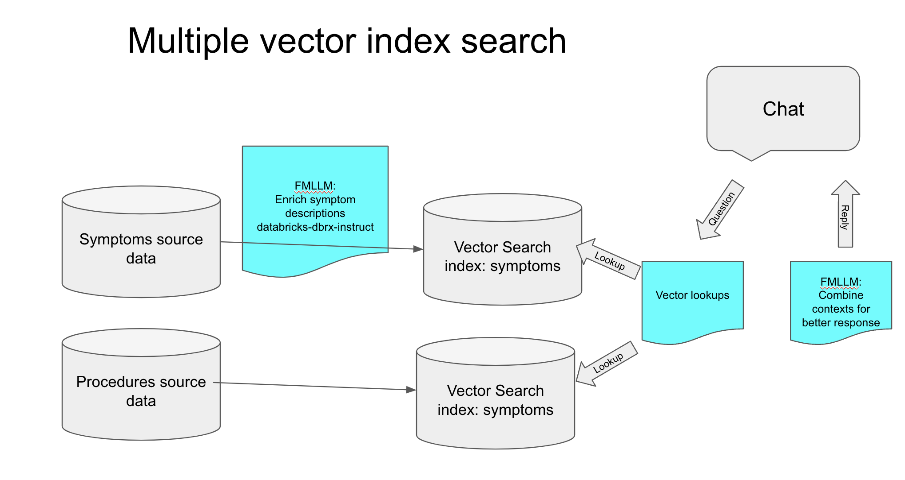

# Health assistant chat bot

Health assistant chat bot to help with health advice.

We use two data sets which are enriched with FBLLMs (DBRX model), and then piped into separate vector searches for better separation.

The llm pipeline can be found in: [etl/health_chat_bot.ipynb](etl/health_chat_bot.ipynb)

